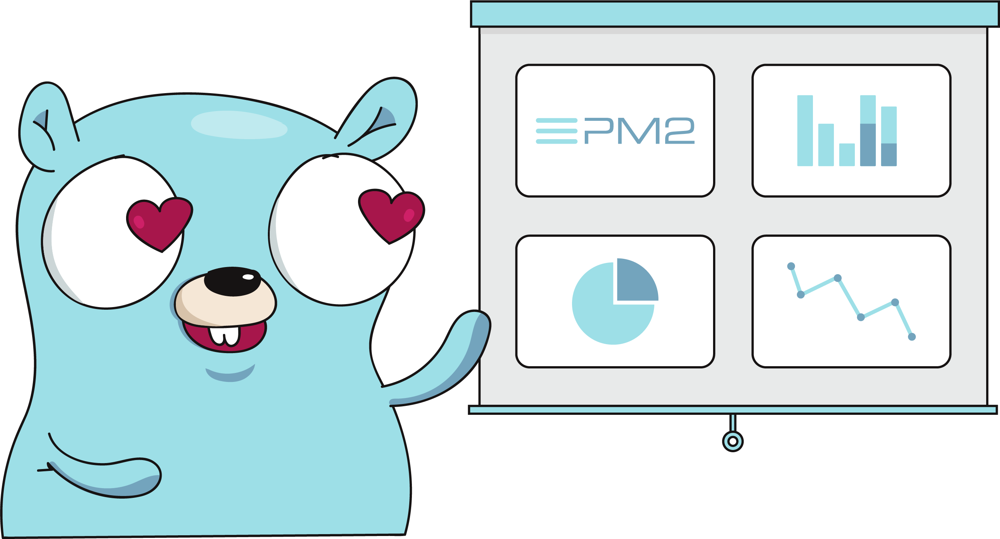

# PM2/io APM Golang
This PM2 module is standalone and must include a public/private key to working properly with PM2 Plus.

## Init

```golang
package main

import (
  "github.com/keymetrics/pm2-io-apm-go/services"
  "github.com/keymetrics/pm2-io-apm-go/structures"
)

func main() {
  // Create PM2 connector
  pm2 := pm2io.Pm2Io{
    Config: &structures.Config{
      PublicKey:  "myPublic",
      PrivateKey: "myPrivate",
      Name:       "Golang app",
    },
  }
  
  // Add an action who can be triggered from PM2 Plus
  services.AddAction(&structures.Action{
    ActionName: "Get env",
    Callback: func(_ map[string]interface{}) string {
      return strings.Join(os.Environ(), "\n")
    },
  })
  
  // Add a function metric who will be aggregated
  nbd := structures.CreateFuncMetric("Function metric", "metric", "stable/integer", func() float64 {
    // For a FuncMetric, this will be called every ~1sec
    return float64(10)
  })
  services.AddMetric(&nbd)
  
  // Add a normal metric
  nbreq := structures.CreateMetric("Incrementable", "metric", "increments")
  services.AddMetric(&nbreq)

  // Goroutine who increment the value each 4 seconds
  go func() {
    ticker := time.NewTicker(4 * time.Second)
    for {
      <-ticker.C
      nbreq.Value++

      // Log to PM2 Plus
      pm2io.Notifier.Log("Value incremented")
    }
  }()

  // Start the connection to PM2 Plus servers
  pm2.Start()

  // Log that we started the program (optional, just for example)
  pm2io.Notifier.Log("Started")
  
  // Wait infinitely (for example)
  <-time.After(time.Duration(math.MaxInt64))
}
```

## Send error then panic
You can send an error to PM2 Plus before panic your program
```golang
name, err := os.Hostname()
if err != nil {
  pm2io.Panic(err)
  // The program will crash with panic just after the message is sent
}
```

## Use a proxy for APM requests and WebSocket
```golang
  pm2io.Pm2Io{
    Config: &structures.Config{
      PublicKey:  "myPublic",
      PrivateKey: "myPrivate",
      Name:       "Golang app",
      Proxy:      "socks5://localhost:1080/",
    },
  }
```

## Connect logrus to PM2 Plus
If you are using logrus, this is an example to send logs and create exceptions on PM2 Plus when you log an error

```golang
package main

import (
  pm2io "github.com/keymetrics/pm2-io-apm-go"
  "github.com/sirupsen/logrus"
)

// HookLog will send logs to PM2 Plus
type HookLog struct {
  Pm2 *pm2io.Pm2Io
}

// HookErr will send all errors to PM2 Plus
type HookErr struct {
  Pm2 *pm2io.Pm2Io
}

// Fire event
func (hook *HookLog) Fire(e *logrus.Entry) error {
  str, err := e.String()
  if err == nil {
    hook.Pm2.Notifier.Log(str)
  }
  return err
}

// Levels for all possible logs
func (*HookLog) Levels() []logrus.Level {
  return logrus.AllLevels
}

// Fire an error and notify it as exception
func (hook *HookErr) Fire(e *logrus.Entry) error {
  if err, ok := e.Data["error"].(error); ok {
    hook.Pm2.Notifier.Error(err)
  }
  return nil
}

// Levels only for errors
func (*HookErr) Levels() []logrus.Level {
  return []logrus.Level{logrus.ErrorLevel}
}

func main() {
  pm2 := pm2io.Pm2Io{
    Config: &structures.Config{
      PublicKey:  "myPublic",
      PrivateKey: "myPrivate",
      Name:       "Golang app",
    },
  }

  logrus.AddHook(&HookLog{
    Pm2: pm2,
  })
  logrus.AddHook(&HookErr{
    Pm2: pm2,
  })
}
```

## Distributed Tracing
NB: you must pass the same `context.Context` to your subfuncs (same traceID).
It's very useful when you want the same trace for HTTP spans and your database spans

[More informations on OpenCensus](https://opencensus.io/guides/)

### HTTP
OpenCensus will create another handler with wrapped functions. It's important to use contexts everytime

For client and server, it use B3 for communication by default

[OpenCensus Documentation about ochttp](https://opencensus.io/guides/http/go/net_http/)
```golang
import (
  "net/http"

  "go.opencensus.io/plugin/ochttp"
)

handler := http.HandlerFunc(func(w http.ResponseWriter, r *http.Request) {
  context := r.Context()
  // Not used here, but you must pass it to lower functions (espacially databases one)

  log.Println("request")
  for i := 0; i < 1000; i++ {
    fmt.Fprintf(w, "Hello")
  }
})

ocHandler := &ochttp.Handler{Handler: handler, IsPublicEndpoint: true}
http.ListenAndServe(":8089", ocHandler)
```

### Mongo
With MongoDB wrapper you have to use a context, do don't create a new one and use the first one created

[OpenCensus Documentation about mongowrapper](https://opencensus.io/guides/integrations/mongodb/go_driver/)

### SQL
You can use it by registration or wrapping, here we use the first one

[OpenCensus Documentation about ocsql](https://opencensus.io/guides/integrations/sql/go_sql/)

```golang
import (
  "database/sql"

  "contrib.go.opencensus.io/integrations/ocsql"
)

// Create a new driver registred with OpenCensus
driverName, err := ocsql.Register("postgres", ocsql.WithOptions(ocsql.TraceOptions{
  AllowRoot:    true,
  Ping:         true,
  RowsNext:     false,
  RowsClose:    false,
  RowsAffected: true,
  LastInsertID: true,
  Query:        true,
  QueryParams:  false, // Don't send value of $1, $2... args
}))
if err != nil {
  log.Fatalf("Failed to register the ocsql driver: %v", err)
  return
}

// Then use the OpenCensus driver as usual
db, err := sql.Open(driverName, fmt.Sprintf(
  "user=%s password=%s dbname=%s host=%s port=%s sslmode=disable",
  cfg.User, cfg.Password, cfg.Database, cfg.Host, cfg.Port))
if err != nil {
  err = errors.Wrapf(err,
    "Couldn't open connection to postgre database",
  )
  return
}

// Use QueryContext for each query
func DeleteThings(ctx context.Context) error {
  q, err := db.QueryContext(ctx, "DROP TABLE things;")
	q.Close()
	return err
}
```

### Other integrations
We didn't test others integrations, but everything compatible with OpenCensus/Zipkin should work without any problem

## Known problems
### x509: unknown authority
You must have the **Let's Encrypt Authority X3** certificate on your machine/container to connect to our backend

#### Alpine based container
```sh
apk add -U --no-cache ca-certificates
```

#### Debian based container
```sh
apt-get install -y ca-certificates
```